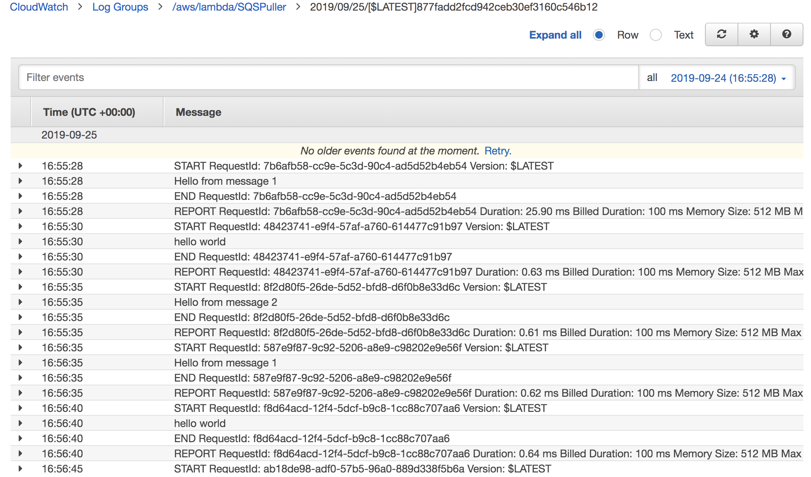
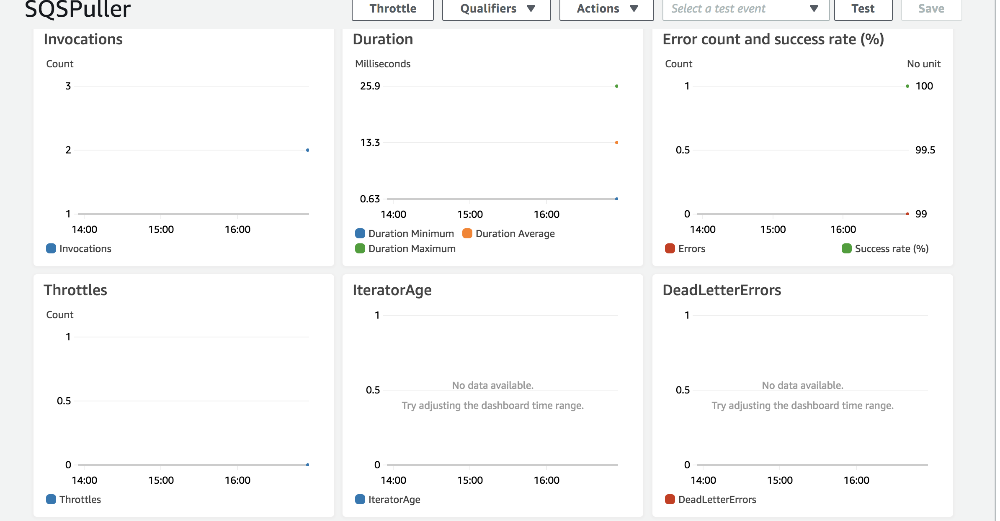

## Lab 36: Message Queues
####  Create 3 standard queues in AWS
```
QueueA
QueueB
QueueC
```
#### Class and Method
```
Receive
receive()
Send
send()
```
* Sends a message to a queue, using its ARN or URL
* Receives messages from a Queue (by ARN) and displays them on logger front end app

#### Resources
Group programming with whole class
  
https://github.com/awsdocs/aws-doc-sdk-examples/blob/master/java/example_code/sqs/src/main/java/aws/example/sqs/SendReceiveMessages.java

## Lab: SQS & Lambda
##### Resources
* https://docs.aws.amazon.com/lambda/latest/dg/with-sqs-create-package.html
  
Classmate: Nicholas Paro 
#### Featured Taks:
* Created Lambda function that is triggered by each of the 3 Queues.
* Wrote the handleRequest function in JAVA
#### Methods
```
handleRequest()

Lambda function:
SQSPuller
```
#### Test:
* Cloudwatch Logs 


* Lambda Monitoring 

